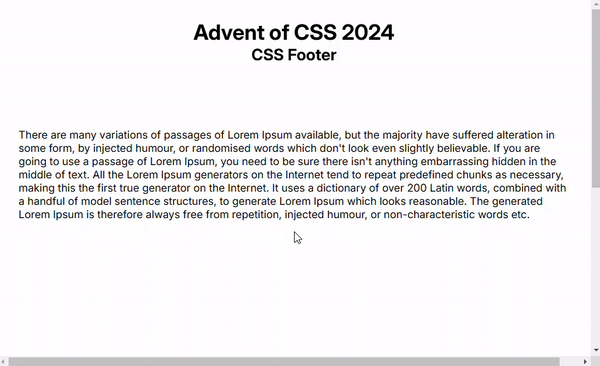

# Advent of CSS 2024

## Challenge 5 - Footer Reveal Upon Scroll-Down

Today's challenge is a scroll-down footer-reveal. 

Original challenge site from Amy Dutton [here](https://www.adventofcss.com/).

## Approach/Demo

Vanilla HTML/CSS was used for this challenge.

A final webpage showing this footer [here](https://myrojoylee.github.io/aoc-2024-challenge-5/).

Demo below showing footer reveal upon scrolling down:

## Credits

Approach was adapted from Chris Coyier's tutorial [here](https://css-tricks.com/the-slideout-footer/).

## License

Refer to the the license in the repository.